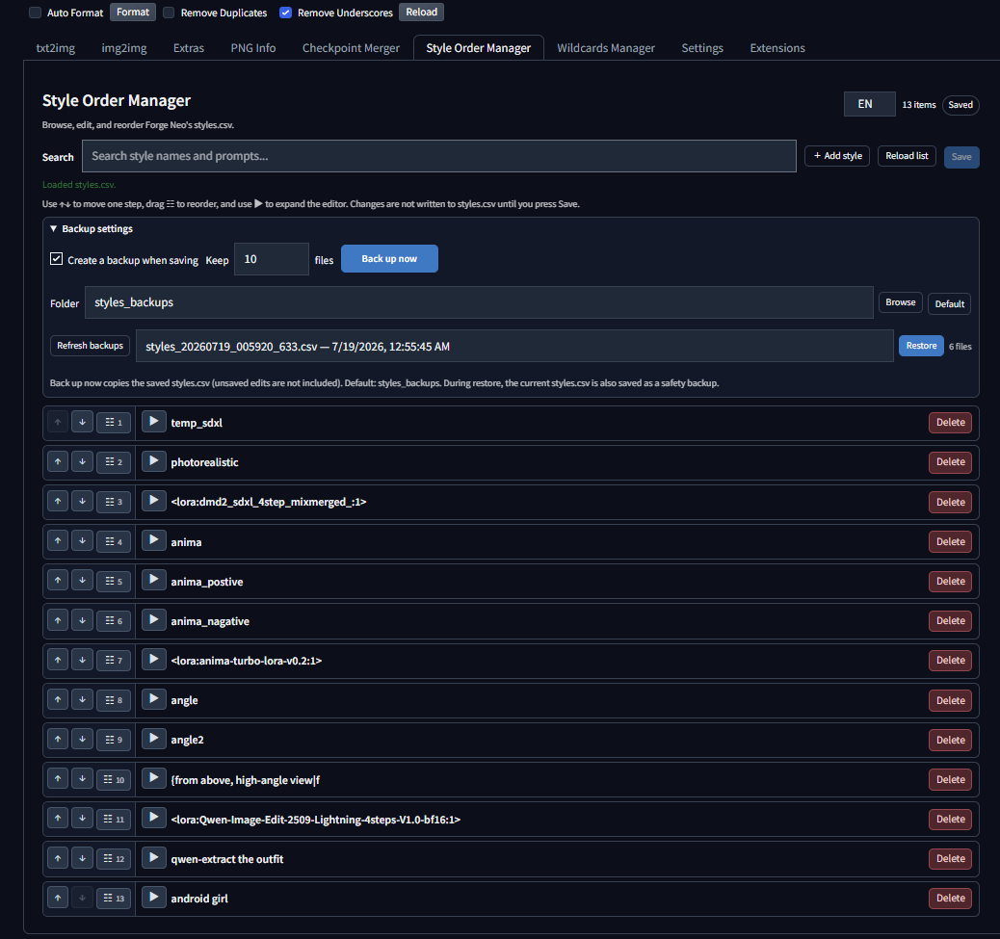
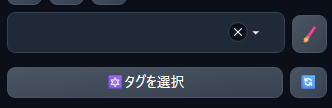

# Style Order Manager

[日本語 README](README_ja.md)



A compact style order manager for Forge Neo and compatible Automatic1111-style WebUI forks. It manages `styles.csv` with a focus on drag-and-drop reordering.

Style Order Manager was created around one simple idea: keep each style on a compact, easy-to-scan single line so reordering a large `styles.csv` stays quick and comfortable. It is intentionally lightweight and includes the minimum practical features—search, edit, add, delete, save, backup, and restore—without trying to be an advanced style-management suite.

It was also created because a large `styles.csv` becomes difficult to understand and maintain when edited directly in a text editor. This focused UI keeps the order and contents easy to scan without becoming a feature-heavy editor.

## Compatibility

- Forge Neo: verified in the current development environment
- ReForge: verified
- Automatic1111: built on the standard extension APIs; not verified yet

## Features

- Drag-and-drop style reordering
- Search, add, delete, and edit `name`, `prompt`, and `negative_prompt`
- Compact one-line cards with move buttons, drag handles, and a dedicated expand triangle
- Copy and paste controls shown only in the expanded prompt editor
- Unsaved-change indicator and explicit Save action
- Automatic backup before saving plus a manual **Back up now** action
- Backup list and restore action
- Theme-aware controls for dark and light WebUI themes
- English default UI with an `EN / JA` switch

## Requirements

- Forge Neo, ReForge, or a compatible Automatic1111-style WebUI
- Standard `styles.csv` format with the header `name,prompt,negative_prompt`
- No additional Python packages are required

## Installation

### Install from the Extensions tab

1. Open **Extensions** → **Install from URL**.
2. Enter:

   `https://github.com/ukr8b3g-cmyk/Style-Order-Manager`

3. Install the extension, apply/restart the WebUI, and open the **Style Order Manager** tab.

### Manual installation

Clone this repository into the WebUI `extensions` folder:

```powershell
git clone https://github.com/ukr8b3g-cmyk/Style-Order-Manager.git <webui-directory>\extensions\style-order-manager
```

Restart the WebUI after installation.

## Usage

1. Open the **Style Order Manager** tab.
2. Drag the `☷` handle to reorder styles.
3. Click a card to inspect or edit its full contents.
4. Press **Save** to write the new order and edits to `styles.csv`.

The CSV header is preserved as `name,prompt,negative_prompt`.

After saving, Style Order Manager automatically refreshes the WebUI's Styles lists. If a compatible fork does not expose the standard refresh control, use its Styles refresh button manually.

### Open the prompt editor

Press the **pencil button** in the WebUI prompt controls to open the prompt/style editing screen.



## Backup and restore

Automatic backups are enabled by default and retain 10 files. **Back up now** immediately copies the saved `styles.csv`; unsaved editor changes are not included. The standard relative path is:

```text
styles_backups
```

This folder is created next to `styles.csv`. If `styles.csv` is in the WebUI root, the resolved path is `<webui-directory>\styles_backups`.

Before a restore, the current `styles.csv` is saved as a safety backup. Old backup files beyond the configured retention count are removed automatically.

## Extension layout

```text
style-order-manager/
├─ javascript/style_order_manager.js
├─ scripts/style_order_manager.py
├─ docs/images/extensions-tab.png
├─ docs/images/prompt-editor.png
├─ style.css
├─ README.md
├─ README_ja.md
└─ .gitignore
```

No `install.py` is needed because the extension uses only WebUI and Python standard-library functionality.

## Extension index registration

The WebUI Extensions tab obtains its available-extension list from an external JSON index. Registration is a separate index update using the repository URL, display name, description, date, and tags such as `tab` and `UI related`.
