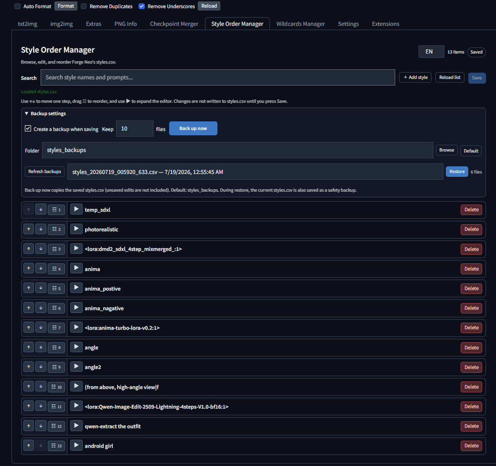
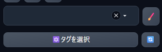

# Style Order Manager

[English README](README.md)



Forge Neo、ReForge、その他のAutomatic1111系WebUIで使える、`styles.csv`の並び順管理ツールです。ドラッグ＆ドロップによる順番変更を主機能にしています。

Style Order Managerは、大量の`styles.csv`でも各スタイルをコンパクトな一行表示で見やすくし、順番変更を軽快に行えることを重視して作りました。検索、編集、追加、削除、保存、バックアップ、リストアなど最低限必要な機能に絞った軽量ツールで、高度な管理機能はあえて多く搭載していません。

スタイル数が多い`styles.csv`をテキストエディターで直接編集すると、順番や内容を把握しにくくなるため、この拡張機能を作成しました。多機能化せず、スタイルの順番と内容を見やすく確認できることに重点を置いています。

## 対応状況

- Forge Neo: 現在の開発環境で動作確認済み
- ReForge: 動作確認済み
- Automatic1111: 標準的な拡張APIを使用。未確認

## 主な機能

- ドラッグ＆ドロップによるスタイル並べ替え
- 検索、追加、削除、`name`・`prompt`・`negative_prompt`の編集
- 一行のコンパクト表示に、上下移動・ドラッグ・専用の展開三角を配置
- コピー／貼り付けは展開したプロンプト編集欄だけに表示
- 未保存変更の表示と明示的な保存操作
- 保存前の自動バックアップと「今すぐバックアップ」
- バックアップ一覧とリストア
- ダーク／ライトテーマに対応した入力欄
- 英語を初期値とした `EN / JA` 切り替え

## 必要条件

- Forge Neo、ReForge、またはAutomatic1111系の対応WebUI
- ヘッダー `name,prompt,negative_prompt` の標準 `styles.csv`
- 追加のPythonパッケージは不要

## インストール方法

### Extensionsタブからインストール

1. WebUIの **Extensions** → **Install from URL** を開きます。
2. 次のURLを入力します。

   `https://github.com/ukr8b3g-cmyk/Style-Order-Manager`

3. インストール後、WebUIに変更を適用して再起動し、**Style Order Manager** タブを開きます。

### 手動インストール

PowerShellまたはコマンドプロンプトで、WebUIの`extensions`フォルダへcloneします。

```powershell
git clone https://github.com/ukr8b3g-cmyk/Style-Order-Manager.git <webui-directory>\extensions\style-order-manager
```

インストール後にWebUIを再起動してください。

## 使い方

1. **Style Order Manager** タブを開きます。
2. `☷` のハンドルをドラッグして順番を変更します。
3. カードをクリックすると内容確認と編集ができます。
4. **Save** を押すと、新しい順番と編集内容が`styles.csv`へ保存されます。

CSVヘッダーは`name,prompt,negative_prompt`のまま維持されます。

保存・リストア後は、WebUI本体のtxt2img/img2imgのStyles一覧を自動更新します。保存後にはバックアップ一覧も更新します。標準の更新ボタンを公開していない互換WebUIでは、Styles欄の更新ボタンを手動で使用してください。

保存・読込・リストア中は、編集・削除・移動・ドラッグ・貼り付けを無効にします。クリップボードの貼り付け中も、読み取りが完了するまで保存などの操作を待たせます。未保存の編集がある状態でリストアするときは、編集が破棄されることを確認画面に表示します。

### 複数タブや外部編集との競合

読込時に、CSVの内容から計算したSHA-256を版情報として保持します。保存・リストア時の版情報が現在のCSVと異なる場合は、HTTP 409で操作を拒否し、画面の未保存編集を残します。編集内容を別の場所に控えてから一覧を再読込し、最新の一覧へ変更を適用し直してください。自動マージや強制上書きは行いません。版情報を送らない古い画面は、WebUIページの再読込が必要です。

拡張内の操作は同じバックエンドプロセスで順番に実行し、CSVの置換直前にも版情報を確認します。ただし、外部エディタ・ホスト本体のスタイル保存・別のバックエンドプロセスは、このロックを共有しません。最後の確認と置換の間の同時書き込みは防げないため、外部からの同時編集は避けてください。

### プロンプト編集画面を開く

WebUIのプロンプト操作欄にある**鉛筆アイコン**を押すと、プロンプト／スタイルの編集画面が開きます。



## バックアップとリストア

自動バックアップは初期値ON、10件保持です。「今すぐバックアップ」は保存済みの`styles.csv`を直ちにコピーします。未保存の編集内容は含まれません。標準の相対パスは次のとおりです。

```text
styles_backups
```

このフォルダは`styles.csv`と同じフォルダ内に作成されます。`styles.csv`がWebUIルートにある場合、実際の保存先は`<webui-directory>\styles_backups`です。

リストア前には、現在の`styles.csv`を安全用バックアップとして保存します。復元内容はCSVと同じフォルダの一時ファイルへコピーし、検証後に一括置換します。コピー・置換が失敗した場合、元のCSVと作成済みの安全用バックアップを保持します。CSVがなくても、一覧を再読込して正当なバックアップを選べば復元できます。この場合は復元前のコピーを作りません。

一覧・リストア・世代整理の対象は、拡張が使う正式なファイル名形式に限定します。形式は`<stem>_YYYYMMDD_HHMMSS_fff.csv`で、拡張子の前に`_manual`または`_pre_restore`が付く場合もあります。既存のミリ秒3桁の名前はそのまま使えます。新規バックアップは小数秒6桁と排他的な新規作成で名前の衝突を防ぎます。`styles_custom.csv`・不正な日付・シンボリックリンクは対象外です。既存バックアップには所有者情報がないため、無関係なファイルにこの正式な形式の名前を付けないでください。専用の保存先を推奨します。

世代の順番は、コピー元CSVの更新日時ではなく、名前に記録した作成日時で判断します。時計が戻った場合も、既存の最新名より後の名前を作ります。保持件数が1件でも、新規バックアップや復元前の安全用コピーを必ず残します。復元失敗時には復旧用のコピーを残すため、一時的に保持件数を超えることがあります。

### 認証とサブパス

拡張の全7エンドポイントは、ホストの既存認証に従います。通常のUI起動ではGradioの`/login_check`を再利用し、セッションCookieの違いとGradio 4の外部認証に対応します。API専用起動では、ホストの`/sdapi/v1/options`に登録された認証を再利用し、`--api-auth`のBasic認証に従います。UI側にはGradio認証を適用し、APIの別資格情報を要求しません。ホストが認証なしの場合は、その動作に従います。認証の連携方法を判別できないホストでは、拡張APIを公開せずエラーを記録します。

資格情報・認証設定・ネットワーク設定は変更しません。画面からのAPIアクセスにはGradioのルート設定を使い、旧ホストでは画面のパスで補います。ルートURLと`--subpath`配下の両方に対応します。リバースプロキシでは、ホストUIと同様に拡張のパスとログインCookieを転送してください。

## 回帰テスト

既存のホスト仮想環境で実行できます。Pythonテストは一時CSV・バックアップだけを使い、GPUバックエンドは読み込みません。

```powershell
<webui-directory>\venv\Scripts\python.exe -B tests\test_style_order_manager.py
node --check javascript\style_order_manager.js
```

任意のブラウザテストには既存のPlaywrightとEdgeが必要です。全APIリクエストをテスト内で処理し、実際の拡張DOMで遅延保存・非同期貼り付け・復元確認・409応答・サブパスを検証します。

```powershell
node tests\test_style_order_manager_ui.cjs
```

検証したホストのバージョンと実画面確認の範囲は、[監査修正の検証記録](docs/audit-fixes-2026-10-01.md)を参照してください。

## 拡張機能の構成

```text
style-order-manager/
├─ javascript/style_order_manager.js
├─ scripts/style_order_manager.py
├─ docs/images/extensions-tab.png
├─ docs/images/prompt-editor.png
├─ style.css
├─ README.md
├─ README_ja.md
└─ .gitignore
```

追加のインストーラー`install.py`は不要です。WebUIとPython標準ライブラリだけを使用します。

## 拡張機能一覧への登録

WebUIのExtensionsタブに表示するには、リポジトリ公開後、外部の拡張機能インデックスへリポジトリURL、表示名、説明、日付、`tab`・`UI related`などのタグを登録します。これはリポジトリ内のファイルとは別の作業です。
